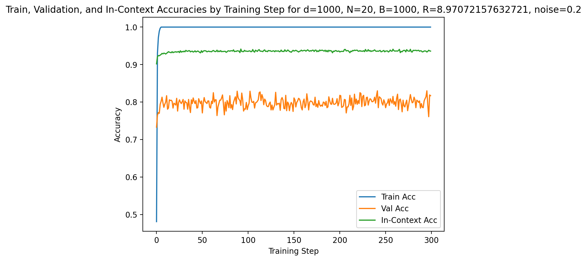
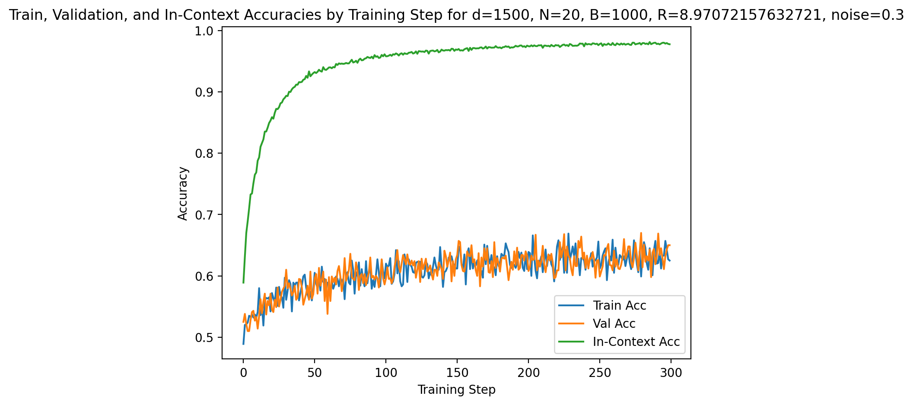

# Investigation into In-Context Learning Capabilities of Transformers on Linear Classification Tasks

## Project Overview

This project reproduces and extends the experimental setting from the paper *Trained Transformer Classifiers Generalize and Exhibit Benign Overfitting In-Context* (2024). The main objective is to understand how transformers — beginning with a simplified one-layer linear attention model — perform **in-context learning (ICL)** for binary classification tasks.

The model is given a sequence of labeled examples:

$$(x_1, y_1), (x_2, y_2), \ldots, (x_N, y_N)$$

and must predict the label of a new query point $x_{N+1}$ **without updating its parameters**. The model must infer the underlying rule that maps each $x_i$ to $y_i$ purely from the examples provided in context.

A major phenomenon explored in this project is **benign overfitting in-context**. This occurs when the model:

- memorizes noisy or label-flipped in-context examples, **yet**
- still generalizes well to unseen, clean test data.

This behavior mirrors what is observed in modern large language models and is a central contribution of the paper.

---

### Data Generation: Gaussian Mixture Model

All experiments use synthetic data generated from the class-conditional Gaussian mixture model described in the paper.

For each classification task $\tau$, data is generated as follows:

- Sample a task-specific mean vector:

$$\mu_\tau \sim \text{Unif}(R \cdot S^{d-1})$$

- Sample labels:

$$y_{\tau,i} \in \{-1, +1\}$$

- Sample Gaussian noise:

$$z_{\tau,i} \sim \mathcal{N}(0, I_d)$$

- Construct inputs:

$$x_{\tau,i} = y_{\tau,i} \mu_\tau + z_{\tau,i}$$

Each task consists of $N$ in-context examples:

$$(x_{\tau,1}, y_{\tau,1}), \ldots, (x_{\tau,N}, y_{\tau,N})$$

followed by a query point $x_{\tau,N+1}$ whose label must be predicted.

At test time, we optionally introduce label noise via flipping:

$$y_{\tau,i} \leftarrow -y_{\tau,i} \quad \text{with probability } p.$$

This setup allows us to test whether a trained transformer exhibits benign overfitting when the in-context examples contain label noise.

---

### Key Parameters

- **$d$** — input dimension  
- **$N$** — number of in-context (training) examples in each task  
- **$B$** — number of pre-training tasks used to train the transformer  
- **$R$** — signal-to-noise ratio controlling task difficulty  
- **$p$** — label-flip probability used to introduce noise at test time  

These parameters define the full synthetic environment in which the transformer is trained and evaluated.


## Structure

The repository is structured as follows:

```
├── results/                     # Saved plots, experiment outputs
│
├── src/
│ ├── icl_classification/        # Code from reference paper Trained Transformer Classifiers Generalize and Exhibit Benign Overfitting In-Context (2024). 
│ ├── icl_reproduction/          # My reproduction of paper environment from scratch
│ │ ├── notebooks/               # Jupyter notebooks for running experiments and plotting
│ │ │ ├── icl.ipynb              # Full pipeline code
│ │ │
│ │ ├── data.py                  # Synthetic Gaussian mixture dataset generator
│ │ ├── model.py                 # Linear transformer classifier implementation
│ │ ├── train_and_eval.py        # Training loop, evaluation logic, metric logging
|
├── README.md # Project documentation
├── requirements.txt # Python dependencies
```

`icl_classification/` contains all of the code published by the authors of Trained Transformer Classifiers Generalize and Exhibit Benign Overfitting In-Context (2024). The README.md in this directory can be referenced to run their experiments.

`icl.ipynb` contains the full pipeline code from data generation to model architecture to model training and evaluation, including plotting. This notebook can be run altogether to gather results. The .py files that follow are all derived from this notebook.

`data.py` contains the code to generate the synthetic dataset as well as tests to confirm dataset contents match expected.

`model.py` contains the model architecture for the Linear Classifier set forth in the reference paper. It also contains tests to verify the forward pass produces correct logits.

`train_and_eval.py` contains the full training loop and evaluation code for the model, as well as plotting. It trains the model, evaluates on unseen tasks, and determines how well the model is memorizing the training data.


## How to Run the Project

### Environment Setup
Run the following commands in your terminal to setup the Conda Environment:
```
conda create -n icl_repro python=3.10
conda activate icl_repro
pip install -r requirements.txt
```
Alternatively, the environment can also be recreated using the provided environment.yml file:
```
conda env create -f environment.yml -n icl_repro
conda activate icl_repro
```

Core Dependencies: Python 3.10+, PyTorch, NumPy, Matplotlib, tqdm

This code was created with the intention of running on CPU. If you are using a GPU, simply change device = "cpu" to device = "cuda". Note that you may have to move models and tensors to the device with .to(device).

### Usage
There are two ways to run this project. A full pipeline can be walked through and ran simply by running all cells in the src/icl.ipynb notebook. Alternatively, the command `python train_and_eval.py` can be ran to conduct model training and evaluation. This command will draw data generated from `data.py` and use the model architecture defined in `model.py`. It will then train the model, run evaluation, and save plots. To change hyperparameters for different training scenarios, simply alter the lists of variables labeled as d_vals, n_vals, etc. Experiments are then ran using the combination of variables d_vals[1], n_vals[1], r_vals[1], etc. then followed by d_vals[2], n_vals[2], r_vals[2], and so forth. This means that not all unique combinations of variables in these lists are tested, rather all the variables in their respective lists at the same index are taken for each run.

### Results and Metrics
When a test is run, logging will print the following metrics every 10 steps: Train Loss, Train Accuracy, Validation Loss, Validation Accuracy, In-Context Accuracy. It is important to understand the distinction between these, as outlined below:

Train Accuracy: How well the model performs on training data

Validation Accuracy: How well the model performs on unseen data/how well the model generalizes. This is also known as the In-Context Learning Accuracy, not to be confused with the In-Context Accuracy described below.

In-Context Accuracy: How well the model memorizes the training data. Thus, we generally expect In-Context Accuracy to exceed that of the Train and Validation Accuracy, especially when noise is present. 

### Plots 

After a run is finished, a plot of these 3 accuracies versus step number is generated and saved in `results/` with the title containing the unique combination of variables used for that run. If a test is run with the same combination of hyperparameters as an existing plot, that plot is overwritten with the new one.



All plots will follow this style, displaying the 3 different accuracies over steps. This specific plot is an example of benign overfitting. We see that the In-Context accuracy is high, above 0.9. This means that the model is doing a good job at memorizing the training data. However, it also reaches 0.8 on validation (unseen) data, displaying an in-context learning accuracy of around 0.8. Given that there is 0.2 label flip/noise introduced in the validation set, this is the theoretical maximum that the validation accuracy can reach - meaning the model performs excellent on training data and overfits to it, but also performs extremely well on unseen data even when noise is present. This is the ideal scenario, showcasing that a model can perform at a theoretical maximum on unseen data without being trained on it - the very definition of in-context learning.



On the other hand, this plot does not show benign overfitting. We see In-Context accuracy much higher than train and validation, meaning that the model is memorizing its training data well. However, both the training and validation performance is under 0.7 at 0.3 noise for both sets. Seeing as how this is under the theoretical maximum, this is an example of regular overfitting but not necessarily benign as the lower validation accuracy means that the model, trained with this set of hyperparameters, is not the best at generalizing to unseen data without being trained on it.

## References

Code was taken and modified from this [repository](https://github.com/spencerfrei/icl_classification), provided by the authors of *Trained Transformer Classifiers Generalize and Exhibit Benign Overfitting In-Context* (2024).
